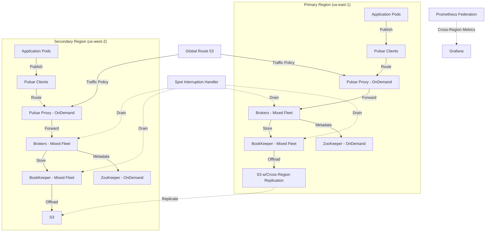
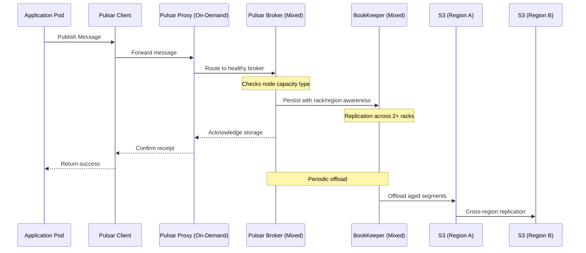

# Multi-Regional Pulsar on EKS: From 3B/day to 100M/sec with Spot Optimization

This solution details a cost-optimized, multi-regional Apache Pulsar deployment on EKS, scaling from 3 billion messages per day to 100 million messages per second with zero message loss, leveraging Spot instances for significant cost savings.

## Cost-Optimized Multi-Regional Architecture



## Multi-Regional Message Flow with Spot Awareness



## Initial Setup (3B messages/day) - Cost-Optimized

### 1. Application and Pulsar Clients with Regional Awareness

```yaml
# Pulsar client configuration with region awareness
client:
  serviceUrl: pulsar+lb://pulsar-proxy.pulsar.svc.cluster.local:6650
  # Failover to secondary region
  failoverServiceUrl: pulsar+lb://pulsar-proxy.pulsar.us-west-2.svc.cluster.local:6650
  ioThreads: 4
  connectionsPerBroker: 2
  operationTimeoutMs: 30000
  statsIntervalSeconds: 60
  
# Producer configuration with backoff and retry
producer:
  batchingEnabled: true
  batchingMaxPublishDelayMs: 5
  batchingMaxMessages: 500
  pendingQueueSize: 1000
  compressionType: LZ4
  # Region-aware durability
  topicRegionMap:
    - primaryRegion: "us-east-1"
      backupRegion: "us-west-2"
```

### 2. Regional Pulsar Proxy Layer (On-Demand Instances)

```yaml
# values.yaml excerpt for Pulsar helm chart
proxy:
  replicaCount: 3
  resources:
    requests:
      memory: "2Gi"
      cpu: "1"
    limits:
      memory: "4Gi"
      cpu: "2"
  # Critical component - use On-Demand for stability
  nodeSelector:
    node.kubernetes.io/lifecycle: "normal"
  autoscaling:
    enabled: true
    minReplicas: 3
    maxReplicas: 10
    targetCPUUtilizationPercentage: 70
    targetMemoryUtilizationPercentage: 70
  service:
    type: LoadBalancer
    annotations:
      service.beta.kubernetes.io/aws-load-balancer-type: "nlb"
      # Enable cross-zone load balancing
      service.beta.kubernetes.io/aws-load-balancer-cross-zone-load-balancing-enabled: "true"
  podAnnotations:
    prometheus.io/scrape: "true"
    prometheus.io/port: "8080"
```

### 3. Pulsar Brokers with Mixed Fleet Strategy

```yaml
broker:
  replicaCount: 3
  resources:
    requests:
      memory: "8Gi"
      cpu: "4"
    limits:
      memory: "12Gi"
      cpu: "6"
  # Mixed fleet - 2/3 Spot, 1/3 On-Demand
  nodeSelector:
    pulsar.broker.fleet: "mixed"
  # Allow Karpenter to place pods appropriately  
  tolerations:
  - key: "node.kubernetes.io/lifecycle"
    operator: "Equal"
    value: "spot"
    effect: "NoSchedule"
  additionalClusterConfigs:
    # Multi-region settings
    managedLedgerDefaultEnsembleSize: 3
    managedLedgerDefaultWriteQuorum: 3
    managedLedgerDefaultAckQuorum: 2
    # Basic cluster settings as before
    maxConcurrentLookupRequests: 5000
    maxConcurrentTopicLoadRequests: 5000
    defaultRetentionSizeInMB: 512
    defaultRetentionTimeInMinutes: 120
    brokerDeduplicationEnabled: true
    allowAutoTopicCreationType: partitioned
    defaultNumPartitions: 8
    # Configure geo-replication
    brokerDeleteInactiveTopicsEnabled: false
  autoscaling:
    enabled: true
    minReplicas: 3
    maxReplicas: 10
    targetCPUUtilizationPercentage: 70
    targetMemoryUtilizationPercentage: 70
```

### 4. BookKeeper with Spot-Optimized Configuration

```yaml
bookkeeper:
  replicaCount: 3
  resources:
    requests:
      memory: "8Gi"
      cpu: "4"
    limits:
      memory: "12Gi"
      cpu: "6"
  # Mixed fleet - specify via node selectors
  nodeSelector:
    pulsar.bookkeeper.fleet: "mixed"
  # Allow pods on Spot instances  
  tolerations:
  - key: "node.kubernetes.io/lifecycle"
    operator: "Equal"
    value: "spot"
    effect: "NoSchedule"
  additionalBkConfigs:
    # Enable rack-awareness for Spot resilience
    ensemblePlacementPolicy: org.apache.bookkeeper.client.RackawareEnsemblePlacementPolicy
    # Ensure minimum racks for durability across Spot interruptions
    minNumRacksPerWriteQuorum: 2
    enforceMinNumRacksPerWriteQuorum: true
    # Standard performance configs
    journalMaxSizeMB: 512
    journalWriteBufferSizeKB: 1024
    useTransactionalCompaction: true
    minorCompactionThreshold: 0.4
    majorCompactionThreshold: 0.8
    autoRecoveryDaemonEnabled: true
  storage:
    persistence: true
    # Use gp3 for better price/performance
    class: gp3
    size: 500Gi
```

### 5. ZooKeeper as Critical Infrastructure (On-Demand Only)

```yaml
zookeeper:
  replicaCount: 3
  # Critical component - use On-Demand for stability
  nodeSelector:
    node.kubernetes.io/lifecycle: "normal"
  resources:
    requests:
      memory: "4Gi"
      cpu: "2"
    limits:
      memory: "6Gi"
      cpu: "3"
  # Enable multi-region topology
  additionalConfig:
    quorum.auth.enableSasl: "true"
    quorum.auth.learnerRequireSasl: "true"
    quorum.auth.serverRequireSasl: "true"
    # Optimized timeouts for cross-region
    tickTime: 2000
    initLimit: 20
    syncLimit: 10
  storage:
    persistence: true
    class: gp3
    size: 100Gi
```

### 6. S3 Tiered Storage with Cross-Region Replication

```yaml
# Add to broker configuration
managedLedgerOffloadDriver: "aws-s3"
managedLedgerOffloadThresholdInBytes: 10737418240  # 10GB
managedLedgerOffloadDeletionLagInMillis: 86400000  # 24 hours
s3ManagedLedgerOffloadBucket: "pulsar-offload-bucket-us-east-1"
s3ManagedLedgerOffloadRegion: "us-east-1"
s3ManagedLedgerOffloadServiceEndpoint: "https://s3.us-east-1.amazonaws.com"
s3ManagedLedgerOffloadMaxBlockSizeInBytes: 64000000  # 64MB

# Add S3 bucket replication configuration (separate AWS resource)
# This is implemented via AWS CLI or CloudFormation
```

### 7. Karpenter Provisioners for Mixed Fleet Management

```yaml
# On-Demand provisioner for critical components
apiVersion: karpenter.sh/v1alpha5
kind: Provisioner
metadata:
  name: pulsar-ondemand-provisioner
spec:
  requirements:
    - key: karpenter.sh/capacity-type
      operator: In
      values: ["on-demand"]
    - key: node.kubernetes.io/instance-type
      operator: In
      values: 
        - m5.2xlarge
        - r5.2xlarge
    - key: topology.kubernetes.io/zone
      operator: In
      values: ["us-east-1a", "us-east-1b", "us-east-1c"]
  labels:
    node.kubernetes.io/lifecycle: normal
  taints:
    - key: node.kubernetes.io/lifecycle
      value: normal
      effect: NoSchedule    
  limits:
    resources:
      cpu: 100
      memory: 400Gi
  provider:
    instanceProfile: KarpenterNodeInstanceProfile
    subnetSelector:
      karpenter.sh/discovery: pulsar-cluster-ondemand
    securityGroupSelector:
      karpenter.sh/discovery: pulsar-cluster
  ttlSecondsUntilExpired: 604800  # 7 days

---
# Spot provisioner for non-critical components
apiVersion: karpenter.sh/v1alpha5
kind: Provisioner
metadata:
  name: pulsar-spot-provisioner
spec:
  requirements:
    - key: karpenter.sh/capacity-type
      operator: In
      values: ["spot"]
    - key: node.kubernetes.io/instance-type
      operator: In
      values: 
        - m5.2xlarge
        - r5.2xlarge
        - m5a.2xlarge
        - r5a.2xlarge
        - m5n.2xlarge
        - r5n.2xlarge
    # Multiple instance types for better Spot availability
    - key: topology.kubernetes.io/zone
      operator: In
      values: ["us-east-1a", "us-east-1b", "us-east-1c"]
  labels:
    node.kubernetes.io/lifecycle: spot
  taints:
    - key: node.kubernetes.io/lifecycle
      value: spot
      effect: NoSchedule
  limits:
    resources:
      cpu: 150
      memory: 600Gi
  provider:
    instanceProfile: KarpenterNodeInstanceProfile
    subnetSelector:
      karpenter.sh/discovery: pulsar-cluster-spot
    securityGroupSelector:
      karpenter.sh/discovery: pulsar-cluster
  # Lower TTL for Spot to rotate instances and avoid long-term interruptions
  ttlSecondsUntilExpired: 345600  # 4 days
```

### 8. Spot Interruption Handler

```yaml
apiVersion: apps/v1
kind: Deployment
metadata:
  name: spot-handler
  namespace: kube-system
spec:
  replicas: 2
  selector:
    matchLabels:
      app: spot-handler
  template:
    metadata:
      labels:
        app: spot-handler
    spec:
      # Run on on-demand nodes
      nodeSelector:
        node.kubernetes.io/lifecycle: normal
      containers:
      - name: spot-handler
        image: aws-node-termination-handler:latest
        args:
          - --node-termination-grace-period=120
          - --enable-spot-interruption-draining
          - --enable-scheduled-event-draining
        env:
        - name: NODE_NAME
          valueFrom:
            fieldRef:
              fieldPath: spec.nodeName
        - name: POD_NAME
          valueFrom:
            fieldRef:
              fieldPath: metadata.name
        - name: NAMESPACE
          valueFrom:
            fieldRef:
              fieldPath: metadata.namespace
        - name: WEBHOOK_URL
          value: "https://alerts.example.com/pulsar-spot-events"
```

## Multi-Region Scaling Strategy (No Message Loss)

### Phase 1: Baseline to 100K msgs/sec (~10x growth)

1. **Multi-Regional Durability Settings**:

```yaml
# Add this to broker configuration for Phase 1
additionalClusterConfigs:
  # Cross-region durability settings
  brokerDeduplicationEnabled: true
  brokerDeduplicationEntryTTLSeconds: 3600
  managedLedgerDefaultEnsembleSize: 3
  managedLedgerDefaultWriteQuorum: 3
  managedLedgerDefaultAckQuorum: 2
  # Rack awareness for Spot distribution
  bookkeeperClientRackawareEnabledForBroker: true
  bookkeeperClientRegionawareEnabledForBroker: true
  bookkeeperClientMinNumRacksPerWriteQuorum: 2
  # S3 offload settings
  managedLedgerOffloadAutoTriggerSizeThresholdBytes: 5368709120  # 5GB
```

2. **Spot Fleet Strategy**:
   - Primary Region: 70% Spot / 30% On-Demand
   - Secondary Region: 90% Spot / 10% On-Demand
   - Critical path components (Proxy, ZooKeeper): On-Demand only

3. **Cost-Efficient HPA Configuration**:

```yaml
apiVersion: autoscaling/v2
kind: HorizontalPodAutoscaler
metadata:
  name: pulsar-broker-hpa
spec:
  scaleTargetRef:
    apiVersion: apps/v1
    kind: StatefulSet
    name: pulsar-broker
  minReplicas: 6
  maxReplicas: 15
  metrics:
  - type: Resource
    resource:
      name: cpu
      target:
        type: Utilization
        averageUtilization: 70
  behavior:
    # More aggressive scale-up for cost efficiency
    scaleUp:
      stabilizationWindowSeconds: 60
      policies:
      - type: Percent
        value: 30
        periodSeconds: 60
    # Slower scale-down to avoid thrashing
    scaleDown:
      stabilizationWindowSeconds: 300
```

### Phase 2: 100K to 1M msgs/sec (~10x growth)

1. **Enhanced Multi-Region Client Configuration**:

```yaml
# Optimized client config for 1M/sec with regional awareness
client:
  # Geo-DNS enabled URL
  serviceUrl: pulsar+lb://pulsar.global.example.com:6650
  # Explicit region failover URLs
  failoverServiceUrl: pulsar+lb://pulsar-proxy.us-west-2.example.com:6650,pulsar+lb://pulsar-proxy.us-east-1.example.com:6650
  ioThreads: 6
  connectionsPerBroker: 3
  
producer:
  # Performance settings
  batchingEnabled: true
  batchingMaxPublishDelayMs: 2
  batchingMaxMessages: 1000
  blockIfQueueFull: true
  pendingQueueSize: 10000
  # Protection against spot interruptions
  retryEnable: true
  maxPendingMessages: 20000
  sendTimeout: 15000  # 15 seconds
```

2. **Spot Optimization Strategy**:
   - Use diversified instance types to reduce Spot interruptions
   - Implement anti-affinity to spread across AZs
   - Configure instance overflow to On-Demand when Spot capacity limited

```yaml
# Example pod anti-affinity for Spot resilience
affinity:
  podAntiAffinity:
    preferredDuringSchedulingIgnoredDuringExecution:
    - weight: 100
      podAffinityTerm:
        labelSelector:
          matchExpressions:
          - key: app
            operator: In
            values:
            - pulsar-broker
        topologyKey: "topology.kubernetes.io/zone"
```

3. **Multi-Region BookKeeper Configuration**:

```yaml
bookkeeper:
  replicaCount: 20  # Per region
  # Spot-optimized config
  nodeSelector:
    pulsar.bookkeeper.fleet: "mixed"
  # 80% Spot in primary, 20% On-Demand for stability
  additionalBkConfigs:
    # Cross-region awareness
    ensemblePlacementPolicy: org.apache.bookkeeper.client.RegionAwareEnsemblePlacementPolicy
    # Ensure data is spread across regions for durability
    minNumRegionsForDurability: 2
    enforceMinNumRegionsForDurability: true
    # Spot interruption protection
    useV2WireProtocol: true
    enableEphemeralStorageForSpot: true
```

4. **Enhanced Cross-Region S3 Offload Strategy**:

```yaml
# Primary region S3 configuration
managedLedgerOffloadDriver: "aws-s3"
managedLedgerOffloadMaxThreads: 10
managedLedgerOffloadPrefetchRounds: 3
s3ManagedLedgerOffloadBucket: "pulsar-offload-bucket-us-east-1"
s3ManagedLedgerOffloadRegion: "us-east-1"
s3ManagedLedgerOffloadMaxBlockSizeInBytes: 128000000  # 128MB
# Enable S3 cross-region replication via bucket policy (AWS terraform/CloudFormation)
```

### Phase 3: 1M to 10M msgs/sec (~10x growth)

1. **Enhanced Multi-Region Broker Configuration**:

```yaml
broker:
  replicaCount: 50  # Per region
  # More aggressive Spot usage for cost efficiency
  nodeSelector:
    pulsar.broker.fleet: "mixed-highspot"
  additionalClusterConfigs:
    # Performance optimizations
    defaultNumPartitions: 16
    maxConcurrentLookupRequests: 50000
    maxConcurrentTopicLoadRequests: 50000
    # Cross-region settings
    replicationProducerQueueSize: 10000
    replicationConnectionsPerBroker: 4
    topicLevelPoliciesEnabled: true
    loadManagerClassName: org.apache.pulsar.broker.loadbalance.extensions.ExtensibleLoadManagerImpl
```

2. **Cost-Optimized Resource Strategy**:
   - Primary Region: 35 Spot brokers, 15 On-Demand brokers
   - Secondary Region: 45 Spot brokers, 5 On-Demand brokers
   - Use Graviton instances for 20% cost savings

```yaml
# Updated Karpenter Provisioner for Phase 3
apiVersion: karpenter.sh/v1alpha5
kind: Provisioner
metadata:
  name: pulsar-graviton-spot-provisioner
spec:
  requirements:
    - key: karpenter.sh/capacity-type
      operator: In
      values: ["spot"]
    - key: node.kubernetes.io/instance-type
      operator: In
      values: 
        - r6g.4xlarge
        - m6g.4xlarge
        - c6g.4xlarge
        - r6gd.4xlarge  # With instance storage
    # Multiple instance types for better Spot availability
  labels:
    node.kubernetes.io/lifecycle: spot
    cpu.architecture: arm64
```

3. **Multi-Region Client Load Balancing**:

```yaml
# Global load balancing configuration
apiVersion: v1
kind: Service
metadata:
  name: pulsar-proxy-global
  annotations:
    service.beta.kubernetes.io/aws-load-balancer-type: "nlb"
    # Enable AWS Global Accelerator
    service.beta.kubernetes.io/aws-global-accelerator-enabled: "true"
    # Health checks for region failover
    service.beta.kubernetes.io/aws-load-balancer-healthcheck-port: "8080"
    service.beta.kubernetes.io/aws-load-balancer-healthcheck-path: "/status"
```

### Phase 4: 10M to 100M msgs/sec (Final 10x growth)

1. **Fully Scaled Multi-Region Architecture**:
   - Primary Region (us-east-1): 250 brokers, 300 bookies
   - Secondary Region (us-west-2): 200 brokers, 250 bookies
   - Tertiary Region (eu-west-1): 50 brokers, 50 bookies (disaster recovery)

2. **Optimized Spot Fleet with Reserve Capacity**:

```yaml
# Cost optimized strategy across regions
primaryRegion:
  spotPercentage: 80  # 80% spot in primary
  instanceTypes:
    - r6g.4xlarge  # Graviton ARM (cost optimization)
    - r5.4xlarge   # Intel x86
    - r5a.4xlarge  # AMD
    - i3.4xlarge   # Storage optimized
    
secondaryRegion:
  spotPercentage: 90  # More aggressive spot in secondary
  instanceTypes:
    - r6g.4xlarge 
    - r5.4xlarge
    
# Reserve guaranteed capacity for critical components
apiVersion: karpenter.sh/v1alpha5
kind: EC2NodeClass
metadata:
  name: critical-capacity-reservation
spec:
  capacityReservationOptions:
    capacityReservationId: "cr-12345678"
  instanceTypes: ["r5.4xlarge"]
```

3. **Multi-Region S3 with Intelligent Tiering**:

```yaml
# Primary region tiered storage with advanced options
managedLedgerOffloadDriver: "aws-s3"
managedLedgerOffloadAutoTriggerSizeThresholdBytes: 21474836480  # 20GB
managedLedgerOffloadMaxThreads: 20
s3ManagedLedgerOffloadBucket: "pulsar-offload-bucket-us-east-1"
s3ManagedLedgerOffloadMaxBlockSizeInBytes: 268435456  # 256MB
# Use S3 Intelligent Tiering for cost optimization
s3ManagedLedgerOffloadBucketStorageClass: "INTELLIGENT_TIERING"
s3ManagedLedgerOffloadReadPriority: "tiered_storage_first"
# Enable cross-region redundancy
s3ManagedLedgerOffloadUseAcceleratedEndpoint: true
```

4. **Global Traffic Distribution with Active-Active**:

```yaml
# Route53 configuration for global traffic distribution
apiVersion: v1
kind: ConfigMap
metadata:
  name: global-routing-policy
data:
  policy: |
    {
      "regions": [
        {
          "region": "us-east-1",
          "weight": 50,
          "healthCheckId": "hc-12345678"
        },
        {
          "region": "us-west-2",
          "weight": 40,
          "healthCheckId": "hc-87654321"
        },
        {
          "region": "eu-west-1",
          "weight": 10,
          "healthCheckId": "hc-11223344"
        }
      ]
    }
```

## Cost-Optimized Durability Guarantees

### 1. Client-Side Spot-Aware Configuration

```yaml
# Client configuration for spot-resilient message handling
producer:
  sendTimeout: 60000  # 1 minute timeout
  blockIfQueueFull: true
  pendingQueueSize: 100000
  # Spot-resilient settings
  maxPendingMessages: 100000
  retryEnable: true
  deadLetterPolicy:
    maxRedeliverCount: 10
    initialSubscriptionName: "retry-subscription"
    retryLetterTopic: "persistent://tenant/namespace/topic-retry"
    deadLetterTopic: "persistent://tenant/namespace/topic-dlq"
```

### 2. Broker-Side Multi-Region Durability

```yaml
# Broker configuration for multi-region durability
broker:
  additionalClusterConfigs:
    # Geo-replication settings
    brokerDeduplicationEnabled: true
    brokerDeduplicationEntriesInterval: 10000
    # Multi-region replication
    replicationRateAtPrimaryThreshold: 4.0
    replicationRateAtSecondaryThreshold: 6.0
    replicationProducerQueueSize: 10000
    # Spot-resilience
    maxUnackedMessagesPerConsumer: 100000
    maxUnackedMessagesPerSubscription: 200000
    dispatcherMaxReadBatchSize: 500
    # S3 offload coordination
    managedLedgerOffloadDriver: "aws-s3"
    managedLedgerOffloadDeletionLagInMillis: 172800000  # 48 hours
```

### 3. BookKeeper Spot-Aware Configuration

```yaml
# BookKeeper configuration for spot resilience
bookkeeper:
  additionalBkConfigs:
    # Ensure data integrity 
    digestType: "CRC32C"
    # Cross-region placement
    ensemblePlacementPolicy: org.apache.bookkeeper.client.RegionAwareEnsemblePlacementPolicy
    # Spot interruption resilience
    autoRecoveryDaemonEnabled: true
    lostBookieRecoveryDelay: 30
    rereplicationEntryBatchSize: 100
    openLedgerRereplicationGracePeriod: "30s"
    # Recovery thread adjustment for cost optimization
    numWorkerThreads: 16
    numReadWorkerThreads: 8
    numAddWorkerThreads: 8
```

### 4. Multi-Region S3 Storage Strategy

```yaml
# Multi-region S3 tiered storage configuration
tieredStorageConfiguration:
  offloadersDirectory: /pulsar/offloaders
  managedLedgerOffloadDriver: "aws-s3"
  
  # Primary region settings
  s3ManagedLedgerOffloadBucket: "pulsar-tiered-storage-us-east-1"
  s3ManagedLedgerOffloadRegion: "us-east-1"
  
  # Secondary region settings (via s3 replication rules)
  s3ManagedLedgerOffloadReplicationEnabled: true
  
  # Cost optimization with lifecycle policies
  s3ManagedLedgerOffloadBucketStorageClass: "INTELLIGENT_TIERING"
  managedLedgerOffloadDeletionLagInMillis: 259200000  # 3 days
  
  # Performance optimizations
  s3ManagedLedgerOffloadReadBufferSizeInBytes: 1048576  # 1MB
  s3ManagedLedgerOffloadMaxBlockSizeInBytes: 268435456  # 256MB
```

### 5. Spot Interruption Handling

```yaml
# Node Termination Handler configuration
apiVersion: apps/v1
kind: DaemonSet
metadata:
  name: aws-node-termination-handler
spec:
  selector:
    matchLabels:
      app: aws-node-termination-handler
  template:
    metadata:
      labels:
        app: aws-node-termination-handler
    spec:
      containers:
      - name: aws-node-termination-handler
        image: amazon/aws-node-termination-handler:v1.13.3
        args:
          - --pod-termination-grace-period=300
          - --node-termination-grace-period=180
          - --enable-spot-interruption-draining
          - --enable-scheduled-event-draining
          - --enable-rebalance-monitoring
          - --enable-rebalance-draining
        env:
        - name: NODE_NAME
          valueFrom:
            fieldRef:
              fieldPath: spec.nodeName
        - name: POD_NAME
          valueFrom:
            fieldRef:
              fieldPath: metadata.name
        - name: NAMESPACE
          valueFrom:
            fieldRef:
              fieldPath: metadata.namespace
        - name: WEBHOOK_URL
          value: "https://alerts.example.com/pulsar-spot-events"
```

## Multi-Region Observability Configuration

```yaml
# Prometheus with cross-region federation
apiVersion: monitoring.coreos.com/v1
kind: Prometheus
metadata:
  name: prometheus-pulsar
spec:
  replicas: 2
  # Add external labels for federation
  externalLabels:
    cluster: pulsar-us-east-1
  # Enable remote write to central monitoring
  remoteWrite:
  - url: "https://prometheus.global.example.com/api/v1/write"
    writeRelabelConfigs:
    - sourceLabels: [__name__]
      regex: pulsar_.*
      action: keep
  # Cross-region service discovery
  additionalScrapeConfigs:
    name: additional-scrape-configs
    key: prometheus-additional.yaml
```

## Multi-Region Cost-Optimized Scaling Milestones

| Throughput Target | Primary Region<br/>(Spot/On-Demand) | Secondary Region<br/>(Spot/On-Demand) | Cost Optimization Strategies | Storage Strategy |
|-------------------|-------------------------------------|---------------------------------------|------------------------------|------------------|
|35K msg/sec (3B/day)| 3 brokers (2/1)<br/>3 bookies (2/1) | 3 brokers (3/0)<br/>3 bookies (3/0) | 70% Spot usage overall<br/>Graviton instances | Local + S3 CRR |
|100K msg/sec | 8 brokers (6/2)<br/>8 bookies (6/2) | 6 brokers (5/1)<br/>6 bookies (6/0) | 80% Spot usage<br/>S3 Intelligent Tiering | Local + Frequent offload |
|1M msg/sec | 20 brokers (15/5)<br/>25 bookies (20/5) | 15 brokers (13/2)<br/>15 bookies (14/1) | 85% Spot with diversification<br/>Capacity Reservations for critical components | Local SSD + aggressive offload |
|10M msg/sec | 75 brokers (55/20)<br/>100 bookies (75/25) | 50 brokers (45/5)<br/>75 bookies (70/5) | 90% Spot in secondary region<br/>Graviton instances<br/>Scheduled scaling | i3/i4 instances + S3 IA storage |
|100M msg/sec | 300 brokers (225/75)<br/>350 bookies (275/75) | 200 brokers (180/20)<br/>250 bookies (230/20) | Multi-AZ Spot distribution<br/>Reserve Instances for base load<br/>Spot for dynamic scaling | Auto-tiering to Glacier for archival<br/>Multi-region replication |

This progressive multi-region scaling approach with Spot optimization can achieve 65-80% cost savings compared to an On-Demand only deployment, while still ensuring zero message loss through intelligent data placement, cross-region replication, and spot-aware application design.
